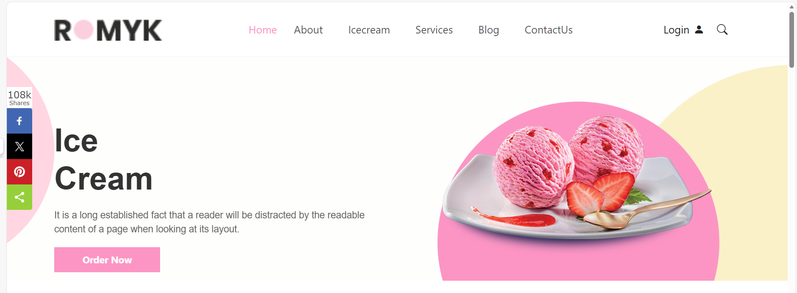
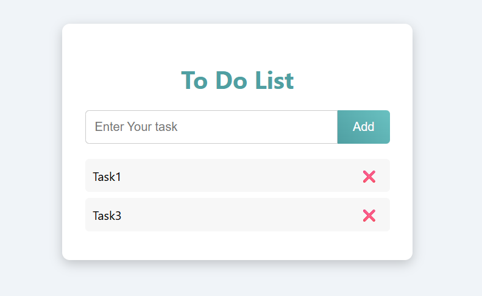
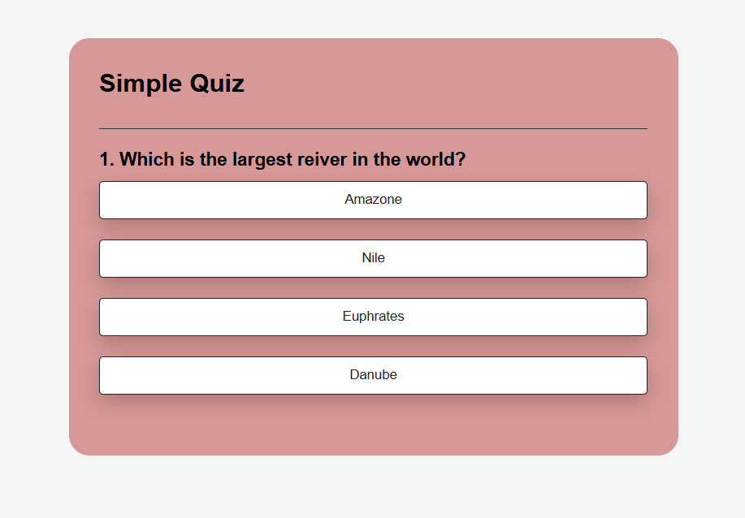

# My Portfolio

Welcome to my personal portfolio! Here you can find some of the projects I have built using JavaScript, HTML, CSS, and React. This portfolio showcases my skills in web development, clean code, and UI design.

---

## Projects

### 1. ROMYK

A simple and interactive movie search application built with React. Users can search for movies, add them to their watch list, and mark them as watched.

- **GitHub:** [ROMYK Project](https://github.com/emantarek48/Romyk-project.git)  
- **Live Demo:** [ROMYK Live](https://emantarek48.github.io/Romyk-project/)

---

### 2. To-Do List

A clean and simple To-Do List application built using Vanilla JavaScript. This project practices DOM manipulation, events, and clean code structure.

- **GitHub:** [To-Do List](https://github.com/emantarek48/Vanilla-JS-ToDo-List.git)  
- **Live Demo:** [To-Do List Live](https://emantarek48.github.io/Vanilla-JS-ToDo-List/)

---

### 3. Quiz App

A simple and interactive quiz application built with HTML, CSS, and JavaScript. Test your general knowledge with multiple-choice questions and see your score at the end.

- **GitHub:** [Quiz App](https://github.com/emantarek48/Simple-Quiz-App.git)  
- **Live Demo:** [Quiz App Live](https://emantarek48.github.io/Simple-Quiz-App/)

---

## Contact Me

You can reach me via **Email**: [emantarek147@gmail.com)  

---

## Live Portfolio
- **Live Demo:** [Quiz App Live]([(https://emantarek48.github.io/Portfolio/)])

https://emantarek48.github.io/Portfolio/
Check out the full portfolio online: [Portfolio Live Demo](https://emantarek48.github.io/portfolio/)
